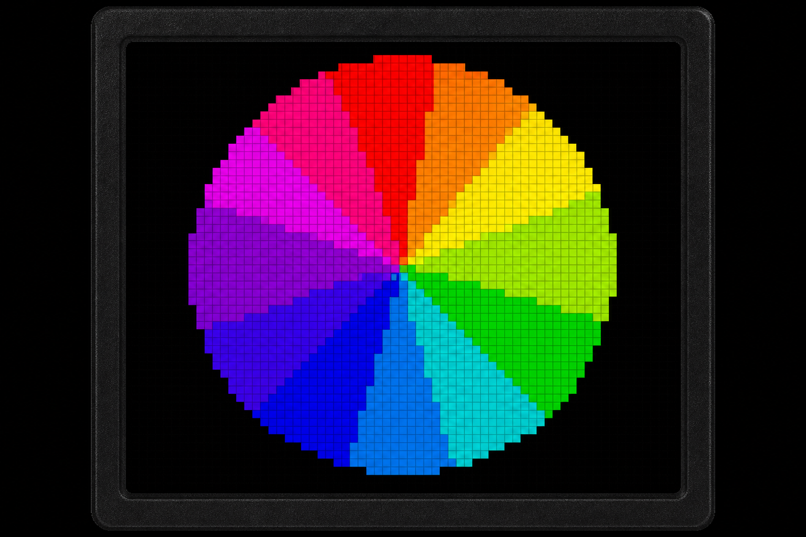
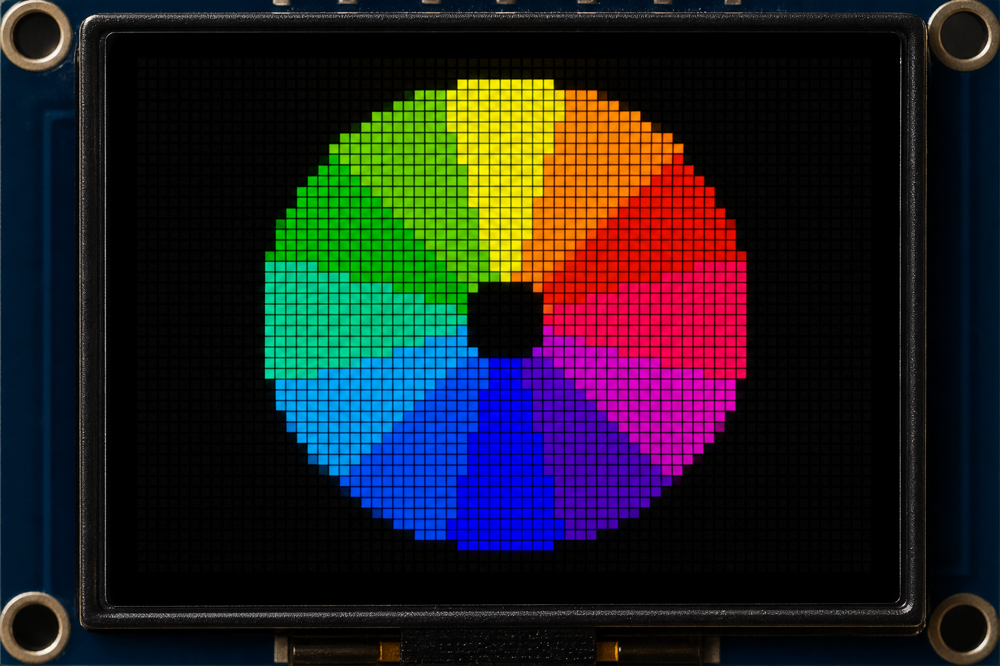
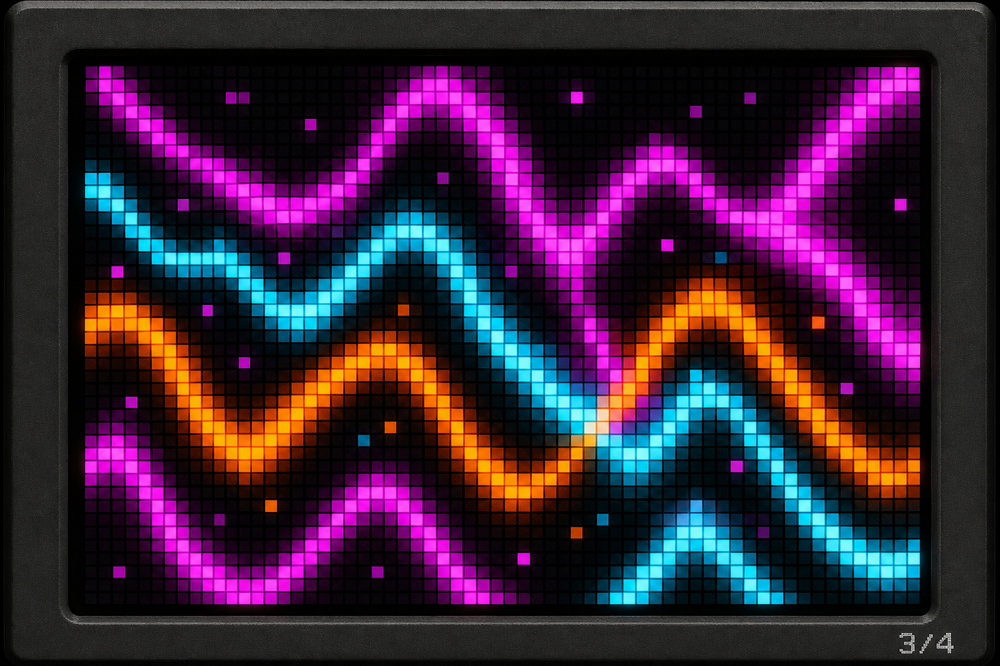
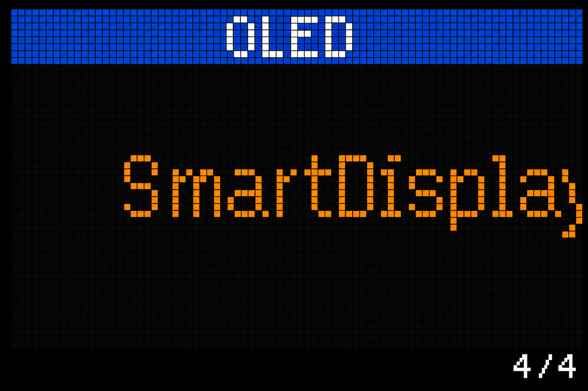

# Animations & Visual Examples

The ISF15ACP4 is ideal for compact animated UIs. This driver includes procedural animations, example apps, and tools for custom artwork.

## Target UI Concept


The `isf15acp4_button_dashboard` example implements a motor-control gauge similar to this layout using `ButtonUI::DrawGauge()`.

## Animation Frame Gallery

These reference frames show what the built-in procedural animations produce on the 96×64 panel:

| Frame | Effect |
|-------|--------|
|  | Color wheel — phase 0° |
|  | Color wheel — phase 90° |
|  | Plasma interference |
|  | Marquee text |

On hardware, the wheel rotates smoothly at 20 FPS via `animations::ColorWheel`.

## Example Applications

| App | Build Command | What It Demonstrates |
|-----|---------------|----------------------|
| `isf15acp4_comprehensive_test` | `./scripts/build_app.sh isf15acp4_comprehensive_test Debug` | Full driver API validation |
| `isf15acp4_ui_demo` | `./scripts/build_app.sh isf15acp4_ui_demo Debug` | Live counter + progress bar |
| `isf15acp4_animation_demo` | `./scripts/build_app.sh isf15acp4_animation_demo Debug` | 4 procedural animations, press to cycle |
| `isf15acp4_button_dashboard` | `./scripts/build_app.sh isf15acp4_button_dashboard Debug` | Gauge, debounced click/long-press |

### Flash and Monitor

```bash
./scripts/flash_app.sh isf15acp4_animation_demo Debug
./scripts/idf_flash_monitor.sh isf15acp4_animation_demo Debug
```

## Creating Custom Animations

Implement an `AnimationFrameFn` callback:

```cpp
void MyEffect(isf15acp4::GraphicsContext& gfx, uint32_t frame, void* user) noexcept {
    gfx.Clear(isf15acp4::colors::Black);
    const uint8_t x = static_cast<uint8_t>((frame * 2) % gfx.Width());
    gfx.FillRect({x, 30, static_cast<uint8_t>(x + 6), 36}, isf15acp4::colors::Orange);
}

isf15acp4::Animator anim(gfx, MyEffect, nullptr, 30);
```

## Video-Style Playback

For imported frame sequences:

1. Convert each PNG frame with `scripts/convert_image_to_rgb565.py`
2. Store pointers in an array
3. Blit the active frame each tick:

```cpp
gfx.BlitRgb565(0, 0, 96, 64, frames[i]);
display.Present(gfx);
```

At 6.6 MHz SPI, budget **~15 ms** per full frame on ISF15ACP4 — target **30 FPS** for smooth motion with CPU headroom.

## Button + Animation Interaction

The animation demo wires the momentary switch to cycle effects on each press:

- **Color Wheel** → **Plasma** → **Scrolling Text** → **Pulse Button** → repeat

The pulse effect reads live `IsPressed()` state for immediate tactile feedback — the same pattern works for confirmation dialogs, hold-to-confirm, and machine start/stop.

## OLED Life Considerations

NKK rates ISF15ACP4 at 50,000 hours with 40% average pixel on-time. For still UIs:

- Use motion or screensavers (`ConfigureScroll()`)
- Dim when idle (`DisplayDim()`)
- Alternate colors to balance pixel wear

See [Hardware Notes](hardware.md) for brightness and aging guidance.
