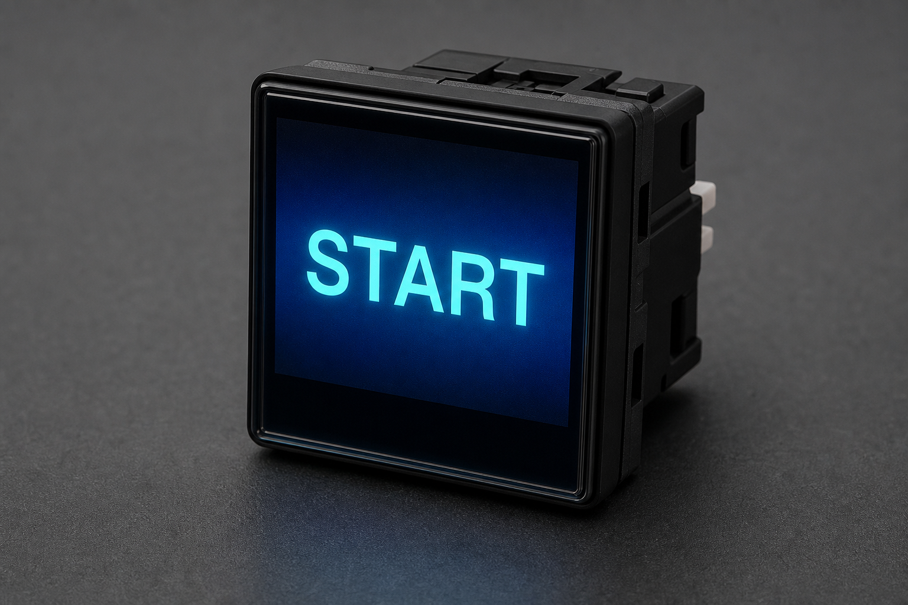
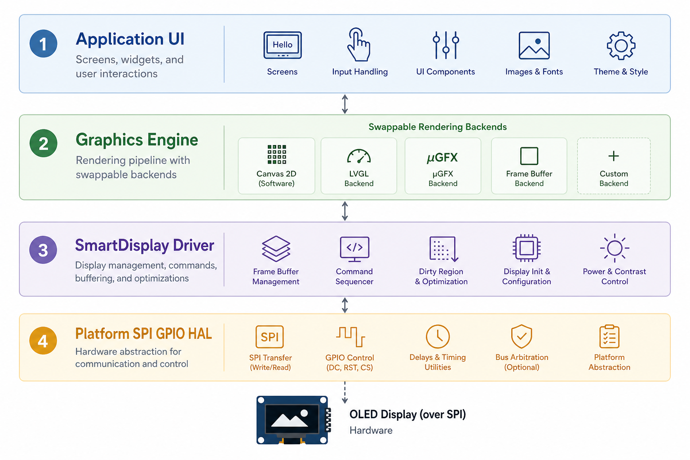
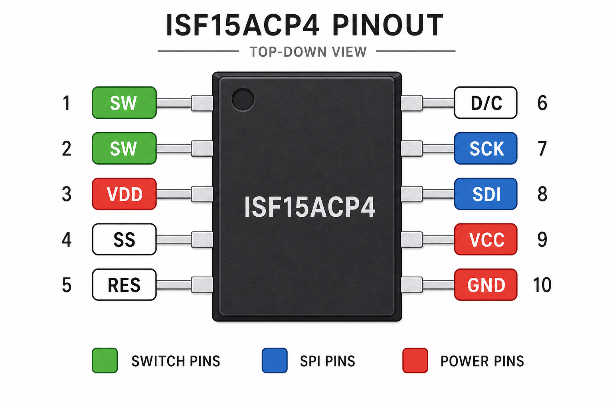
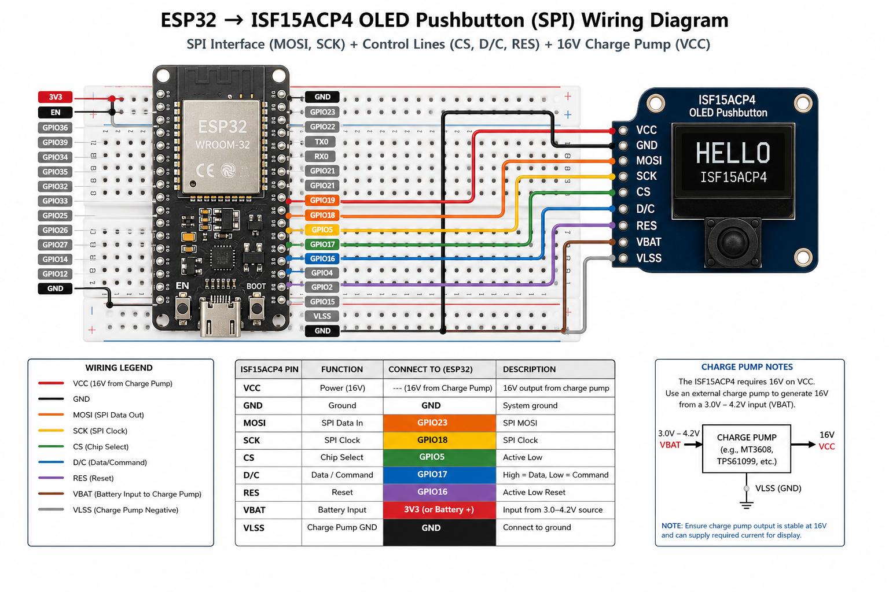

# Architecture

The HF-ISF15ACP4 driver is organized as a layered, MCU-agnostic stack. Each layer has a single responsibility and can be replaced without rewriting application logic.



## Layer Overview



| Layer | Responsibility | Key Types |
|-------|----------------|-----------|
| **Application** | Your UI, animations, control logic | FreeRTOS tasks, callbacks |
| **Graphics Engine** | Swappable render backend | `GraphicsContext`, `GraphicsBackend`, `Animator`, `ButtonUI` |
| **SmartDisplay Driver** | SSD1331 protocol, power, switch | `SmartDisplay<SpiType>` |
| **Transport** | SPI + GPIO CRTP contract | `SpiInterface<Derived>` |
| **Platform HAL** | MCU peripherals | ESP32 SPI master, GPIO, charge pump |

## Graphics Backend Selection

Choose the graphics engine when constructing the display:

```cpp
isf15acp4::SmartDisplayConfig config{
    .variant = isf15acp4::ProductVariant::Isf15acp4,
    .graphics = isf15acp4::GraphicsBackend::Animator,  // or BuiltinCanvas, HardwareDirect
    .enable_vcc_on_init = true,
};

isf15acp4::SmartDisplay display(&adapter, config);
isf15acp4::GraphicsContext gfx = display.CreateGraphicsContext();
display.ConfigurePresenter(gfx);  // required for HardwareDirect
```

### Available Backends

| Backend | Best For | Framebuffer | Notes |
|---------|----------|-------------|-------|
| `BuiltinCanvas` | Static screens, text, icons | Yes (CPU) | Default — full 5×7 font + blit |
| `HardwareDirect` | Sparse overlays, lines, boxes | No | Uses SSD1331 draw commands live |
| `Animator` | Smooth procedural effects | Yes (CPU) | Canvas + `Animator` frame sequencer |

All backends share the same `GraphicsContext` drawing API. Call `display.Present(gfx)` to flush to the panel.

## SPI Transport Contract

The ISF15ACP4 uses **SPI mode 0** with **software SS** and **D/C**:

1. **Command path** — `BeginCommand()` → opcode + parameters → `EndTransaction()`
2. **Data path** — `BeginData()` → RGB565 pixel stream → `EndTransaction()`

NKK requires each command and its parameter bytes to complete in one SS-low session. Always wait for SPI completion before releasing CS.



## Power-Up Sequence

Per [NKK OLED application notes](https://docs.nkkswitches.com/docs/application-notes/oled-application-notes/):

1. **VCC disabled** at power-up (charge pump shutdown)
2. **RES** held low ≥ 3 µs, then released
3. **VCC enabled** before display turn-on
4. **VCC must never be below VDD** (internal ESD clamp)

The driver handles steps 2–4 when `Initialize(true)` is called with `VccEnable` wired.

## Product Variants

| Part | Resolution | Init Table | Typical Use |
|------|------------|------------|-------------|
| **ISF15ACP4** | 96×64 | Table 3 | Frameless pushbutton (50k hr) |
| ISC15ANP4 | 64×48 | Table 1 | Standard pushbutton |
| ISC01P | 52×36 | Table 2 | Display-only module |

## Frame Pipeline

For full-screen updates (most UI and animation):

1. Draw into `GraphicsContext` / `Canvas` (12,288 bytes RGB565 for ISF15ACP4)
2. `SmartDisplay::Present(gfx)` sets the GRAM window and streams pixels
3. SSD1331 immediately refreshes the OLED from GRAM

Theoretical max frame rate at 6.6 MHz SPI: **~67 FPS** for ISF15ACP4 (real-world: 30–45 FPS depending on CPU).

## Wiring Reference



See [Hardware Notes](hardware.md) for charge pump requirements and layout recommendations.
