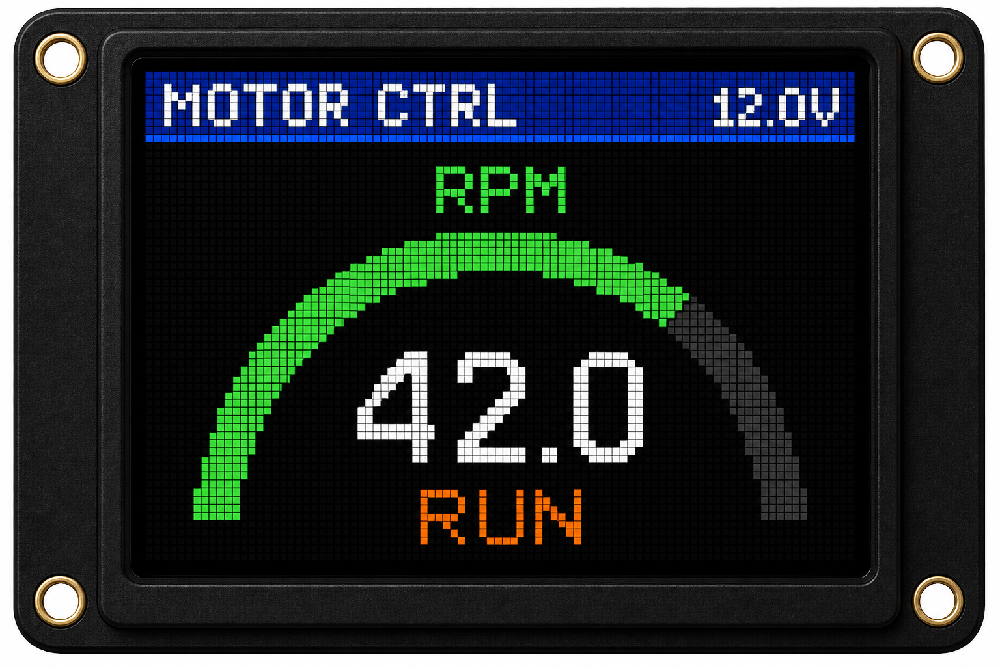

# Graphics Guide

> For backend selection and animation APIs, see [Graphics Engines](graphics_engines.md) and [Animations](animations.md).

## Canvas & GraphicsContext

`GraphicsContext` is the unified drawing surface regardless of backend. It exposes the same API as `Canvas` for software rendering paths.



```cpp
auto gfx = display.CreateGraphicsContext();
gfx.Clear(isf15acp4::colors::Black);
gfx.FillRect({10, 10, 50, 30}, isf15acp4::colors::Blue);
gfx.DrawString(12, 14, "OK", isf15acp4::colors::White);
display.Present(gfx);
```

## Colors

| Helper | Usage |
|--------|-------|
| `MakeColor565(r, g, b)` | Build from 8-bit channels |
| `colors::White`, `Red`, `Cyan`, … | Named presets |
| `BmpPixelToColor565(bgr)` | Import from 24-bit BMP pixel |

RGB565 layout: **R5 G6 B5** — two bytes per pixel, high byte first on SPI.

## Text Rendering

Built-in 5×7 font covers ASCII 32–126. Character width: 5 px + 1 px spacing.

```cpp
gfx.DrawString(4, 4, "RPM 42.0", isf15acp4::colors::White);
```

## Hardware Primitives

When using `HardwareDirect` or calling `SmartDisplay` directly:

| Method | SSD1331 Command |
|--------|-----------------|
| `DrawLine()` | 21H |
| `DrawRectangle()` | 22H (optional fill) |
| `ClearWindow()` | 25H |
| `DrawPixel()` | Window + 2-byte write |

## Image Import Pipeline

1. Design at **96×64** (or scale with 75% vertical compression per NKK)
2. Export PNG
3. Convert:

```bash
python scripts/convert_image_to_rgb565.py icon.png -o inc/my_icon.hpp -n MyIcon
```

4. Blit at runtime:

```cpp
gfx.BlitRgb565(0, 0, kMyIconWidth, kMyIconHeight, kMyIconRgb565);
```

## Performance Tips

- Batch full frames with `Present()` rather than per-pixel SPI transactions
- Target 6.6 MHz SPI clock (datasheet maximum)
- Use `Animator` at 25–30 FPS for smooth motion without saturating SPI
- Prefer dim mode or lower master current for static screens (extends OLED life)
