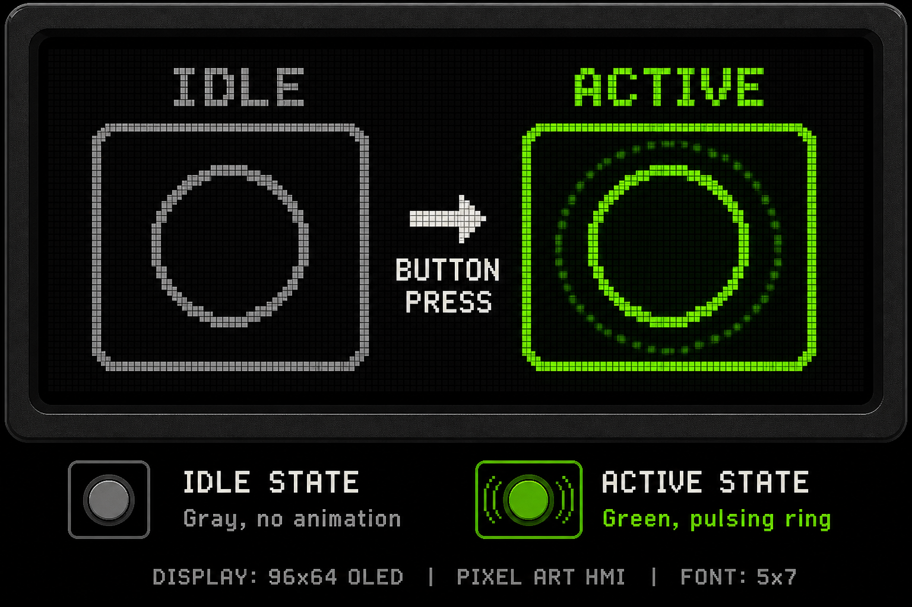

# Graphics Engines

The driver ships **three interchangeable graphics backends**. Select at `SmartDisplay` construction — the same drawing API works throughout your application.

## BuiltinCanvas (default)

CPU-side RGB565 framebuffer with software primitives:

- 5×7 ASCII font
- Lines, rectangles, fills, blits
- Full-frame upload via `Present()`

**Use when:** building screens, menus, status displays, imported images.

```cpp
isf15acp4::SmartDisplayConfig cfg{.graphics = isf15acp4::GraphicsBackend::BuiltinCanvas};
isf15acp4::SmartDisplay display(&adapter, cfg);
auto gfx = display.CreateGraphicsContext();

gfx.Clear(isf15acp4::colors::Black);
gfx.DrawString(4, 4, "READY", isf15acp4::colors::White);
display.Present(gfx);
```

## HardwareDirect

Bypasses the CPU framebuffer. Each draw call maps to SSD1331 hardware commands (`21H` line, `22H` rectangle, pixel window writes).

**Use when:** drawing a few primitives without allocating 12 KB RAM, or overlaying on existing GRAM content.

```cpp
isf15acp4::SmartDisplayConfig cfg{.graphics = isf15acp4::GraphicsBackend::HardwareDirect};
isf15acp4::SmartDisplay display(&adapter, cfg);
auto gfx = display.CreateGraphicsContext();
display.ConfigurePresenter(gfx);  // binds display presenter hooks

gfx.DrawRect({10, 10, 50, 30}, isf15acp4::colors::Cyan);  // sent live to panel
display.Present(gfx);  // no-op for HardwareDirect
```

## Animator

Built on BuiltinCanvas plus the `Animator` frame sequencer. Includes procedural effects:

| Effect | Function | Description |
|--------|----------|-------------|
| Color Wheel | `animations::ColorWheel` | Rotating HSV spectrum |
| Plasma | `animations::Plasma` | Sine interference pattern |
| Scrolling Text | `animations::ScrollingText` | Horizontal marquee |
| Pulse Button | `animations::PulseButton` | Press-reactive visual |

```cpp
isf15acp4::SmartDisplayConfig cfg{.graphics = isf15acp4::GraphicsBackend::Animator};
auto gfx = display.CreateGraphicsContext();

isf15acp4::Animator anim(gfx, isf15acp4::animations::Plasma, nullptr, 25);
while (true) {
    if (anim.Tick(33)) {
        display.Present(gfx);
    }
}
```

## ButtonUI Helper

High-level debounced switch handling with visual feedback:

```cpp
isf15acp4::ButtonUI button;
auto event = button.Update(display.IsPressed(), elapsed_ms);

switch (event) {
    case isf15acp4::ButtonEvent::Click:      /* toggle */ break;
    case isf15acp4::ButtonEvent::LongPress:   /* reset */ break;
    default: break;
}

button.DrawStatus(gfx, "START", display.IsPressed());
ButtonUI::DrawGauge(gfx, 48, 40, 28, 0.7f, colors::Green, colors::Gray);
```



## Switching Backends at Runtime

Backends are fixed at `SmartDisplay` construction, but you can create multiple `GraphicsContext` instances or multiple `SmartDisplay` objects if you need different engines on different panels.

For a single panel, pick the backend that matches your RAM and refresh strategy:

| Scenario | Recommended Backend |
|----------|---------------------|
| Full UI screens | `BuiltinCanvas` |
| Live graphs / effects | `Animator` |
| Minimal RAM overlays | `HardwareDirect` |

## Importing Images

Convert PNG assets to embeddable RGB565 arrays:

```bash
python scripts/convert_image_to_rgb565.py artwork.png -o inc/demo_splash.hpp -n Splash
```

Then blit into any backend:

```cpp
gfx.BlitRgb565(0, 0, kSplashWidth, kSplashHeight, kSplashRgb565);
display.Present(gfx);
```

NKK recommends **75% vertical compression** when scaling desktop art to ISF15ACP4 due to non-square pixels.
